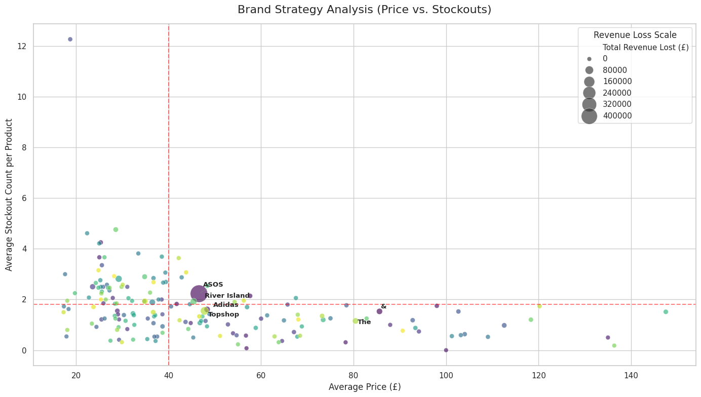
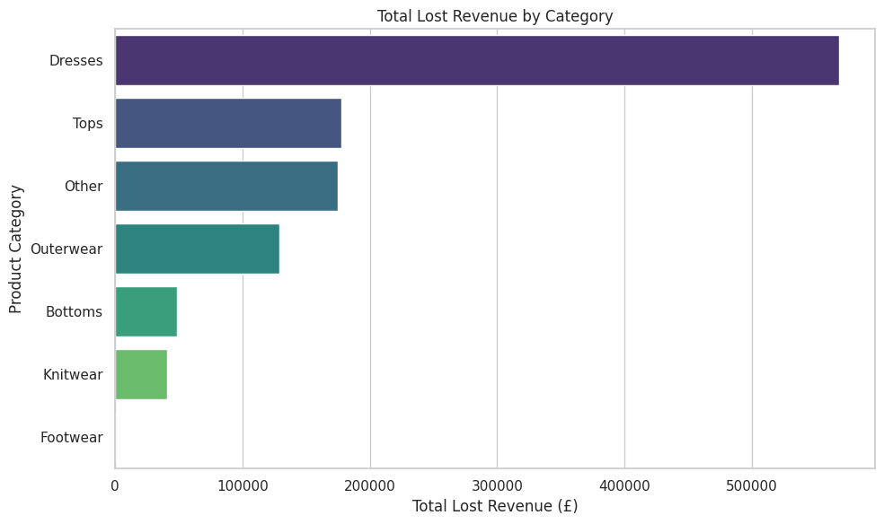
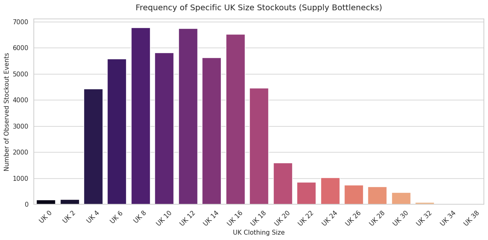
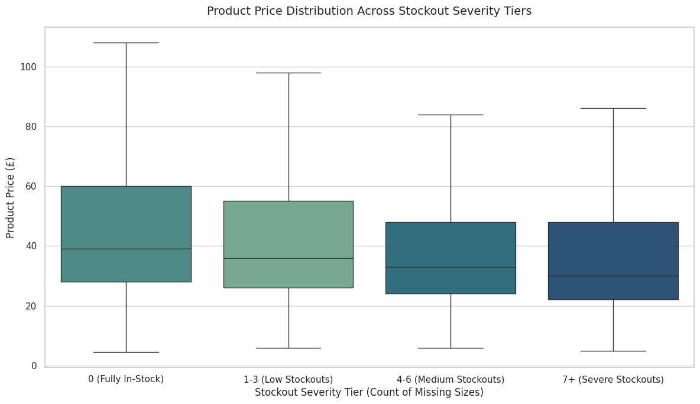

# ASOS Inventory & Supply Chain Analysis: Optimizing Phantom Revenue Loss

An end-to-end data analysis and supply chain risk intelligence project that extracts insights from scraped ASOS e-commerce data. This project identifies operational inefficiencies, quantifies financial leakages due to out-of-stock items ("Phantom Revenue Loss"), and provides strategic recommendations for inventory restocking.

---

## 📌 How This Project Started

While browsing Kaggle, I discovered a raw, scraped e-commerce dataset containing over 30,000 products from ASOS. Upon inspection, the dataset was completely unstructured—prices were stored as text strings with symbols, sizing information was trapped in cluttered lists, and brand names were buried inside lengthy product descriptions. 

Recognizing that this reflects real-world data engineering challenges, I initiated this project to transform this chaotic e-commerce data into structured supply chain intelligence. By engineering clean data pipelines from scratch in Google Colab, I aimed to simulate how a retail data analyst solves a massive industry problem: tracking consumer demand that goes unfulfilled because an item is out of stock.

---

## 🎯 Project Goal & Key Business Problems Solved

The primary goal of this project is to **quantify and locate "Phantom Revenue Loss"**—the financial value of demand that went completely uncaptured because specific sizes were out of stock when consumers visited the site.

### Key Business Problems Solved:
1.  **De-cluttering Categorical Visualizations:** Standard scatterplots grouped by thousands of unique products create an unreadable "smudge." I engineered data aggregation metrics to scale observations by macro-level brand strategies.
2.  **Locating Financial Leakage:** Pinpointing exactly which apparel categories suffer from the most severe supply chain issues.
3.  **Identifying Sizing Bottlenecks:** Determining if size stockouts are random or if the inventory system systematically under-orders popular consumer sizes.
4.  **Correlating Price with Risk:** Testing whether cheaper, high-turnover items carry a fundamentally different inventory risk than premium-priced merchandise.

---

## 🚀 Project Overview

In retail, e-commerce stockouts do not just represent missing products; they represent uncaptured market demand and straight financial leakage. This project analyzes a dataset of over 30,000 ASOS products to isolate supply chain bottlenecks by brand, item category, and specific sizing tiers.

### Key Business Metrics Derived:
*   **Stockout Rate**: The proportion of missing sizes relative to the total sizes offered for a unique product.
*   **Lost Revenue (Phantom Revenue)**: `Product Base Price` $\times$ `Total Count of Out-of-Stock Sizes`. This quantifies the gross financial value of demand that went completely unfulfilled.

---

## 🛠️ Tech Stack & Environment

*   **Platform**: Google Colab
*   **Language**: Python 3
*   **Core Libraries**: 
    *   `pandas` (Data manipulation, string parsing, and aggregation)
    *   `numpy` (Numerical operations)
    *   `matplotlib` & `seaborn` (Advanced data visualization)
    *   `adjustText` (Iterative label alignment algorithms)
    *   `re` (Regular expression parsing for sizing string features)

---

## 📈 Executive Insights & Visualizations

### 1. Brand Strategy Analysis (Price vs. Restock Risk)
*   **The Problem**: A standard scatterplot grouped by brand created an unreadable categorical smudge due to the massive volume of unique manufacturers. 
*   **The Solution**: Data points were aggregated into macro-level brand strategies plotting **Average Price vs. Average Stockout Count**, scaled dynamically by **Total Lost Revenue**. `adjustText` was used to programmatically align and highlight major risk drivers.
*   **Insight**: **ASOS (In-House Brand)** represents a massive outlier, sitting squarely in the high-price, high-stockout danger quadrant, indicating substantial unfulfilled demand for proprietary lines.



### 2. Category Failure Modes
*  **The Problem**: The raw data contains text product categories that are too specific, obscuring high-level macro patterns across broad lines of apparel.
*  **The Solution**: I engineered a keyword-matching string function using apply() to categorize unstructured text into standardized apparel groups **(Dresses, Outerwear, Tops, Bottoms, etc.)** and plotted their sum values.
*   **Insight**: Grouping text descriptions into strict item families revealed that **Dresses** dwarf all other apparel categories combined in terms of total uncaptured revenue. Inventory optimization should start here.



### 3. Size-Level Supply Bottlenecks
*   **The Problem**: Out-of-stock details are trapped inside unstructured text strings representing a product's size matrix, making size-level counts impossible to run natively.
*   **The Solution**: Using regular expressions, I extracted individual standard UK sizes from rows flagged with **"Out of stock"**. I then used the pandas .explode() method to flatten these lists, turning single product listings into unique, size-level frequency observations.
*   **Insight**: Standardizing size availability data revealed a near-perfect bell curve centered over **UK 8, UK 10, and UK 12**. The supply chain is systematically under-ordering the most popular, mainstream consumer sizes while over-indexing on fringe sizes.



### 4. Pricing Resilience Tiers
*   **The Problem**: We need to understand if inventory risk is identical across budget lines and luxury lines, or if price changes a product's turnover profile.
*   **The Solution**: I engineered categorical "Severity Tiers" based on the raw count of stockouts per product. Using a distributional boxplot with extreme outliers removed (showfliers=False), I evaluated the distribution of baseline prices across these risk tiers.
*   **Insight**: A distributional boxplot across stockout severity levels indicates that low-to-mid tier budget items (£20 - £45) experience the highest frequency of extreme size depletion, fueled by faster retail turnover rates.



---

## 💻 Code Structure & Workflow

1.  **Ingestion & Data Type Correction**: Loading Kaggle e-commerce data and strictly coercing prices into floating-point numerical types using `pd.to_numeric()`.
2.  **Feature Extraction**: Applying customized string-splitting algorithms and regex architectures to clean messy string objects into countable inventory features.
3.  **Algorithmic Restructuring**: Leveraging `.explode()` arrays to flatten nested size string records into clean statistical frequency tables.
4.  **Reporting**: Exporting cleanly segmented DataFrames pointing out exactly which brands demand immediate warehouse replenishment.

---

## 📊 Data Source
The dataset used in this analysis was sourced from **Kaggle** (ASOS Scraped Product Dataset).

---

## 🔧 How to Run
1. Open a blank notebook in **Google Colab**.
2. Clone this repository or upload the notebook file.
3. Download the `products_asos.csv` file directly from this repository or downlosd form Kaggle and place it in your local runtime working directory.
4. Install the required text optimization library:
   ```bash
   !pip install adjustText